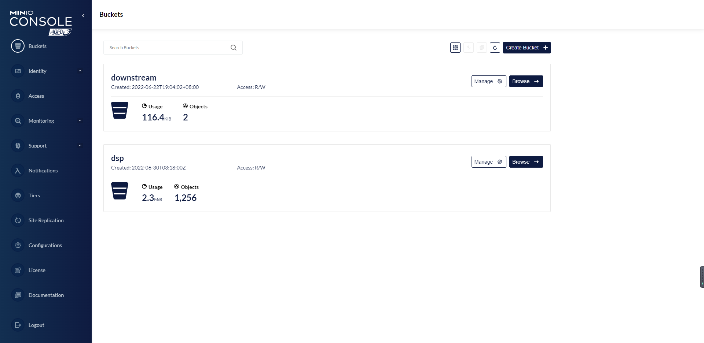
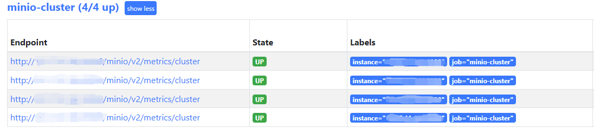

> 1. 从官网直接下载minio二进制可执行文件  
https://min.io/download#/linux  
选择amd64架构，MINIO SERVER选择binary，下载可执行的二进制文件  


> 2. 配置服务器磁盘 

四台节点执行下列操作  
* 创建/data目录  
* 使用ext4格式格式化数据盘  
* 使用mount命令挂载数据盘至/data目录  
* 在fstab文件写入配置做持久化挂载
```shell  
[root@ecm-minio-1 ~]# mkdir /data
[root@ecm-minio-1 ~]# mkfs.ext4 /dev/vdb
[root@ecm-minio-1 ~]# mount /dev/vdb  /data
[root@ecm-minio-1 ~]# cat /etc/fstab  
/dev/vdc /data/                   ext4     defaults        0 0  
```
> 3. 配置启动脚本

四台服务器执行下列操作

* 在/opt目录下创建/minio目录，将下载的minio二进制文件移动到此目录
* 在/data目录下创建/minio-data目录，用于存放数据  
* 在/opt/minio目录下创建名为start.sh的启动脚本写入内容 
```shell
[root@ecm-minio-1 ~]# mkdir /opt/minio  
[root@ecm-minio-1 ~]# mkdir /data/minio-data  
[root@ecm-minio-1 ~]# cat /data/minio-data/start.sh  
#!/bin/bash  
export MINIO_ACCESS_KEY=xxx #填写用户名  
export MINIO_SECRET_KEY=xxx  #填写密钥  
/opt/minio/minio server \  
--console-address ":9001" \  
http://x.x.x.x/data/minio-data \  
http://x.x.x.x/data/minio-data \  
http://x.x.x.x/data/minio-data \  
http://x.x.x.x/data/minio-data  
```
配置服务minio-service  
```shell
[root@ecm-minio-1 ~]# vi /etc/systemd/system/minio.service
[Unit]  
Description=Minio service  
Documentation=https://docs.minio.io/

[Service]  
WorkingDirectory=/opt/minio/  
ExecStart=/opt/minio/start.sh
  
Restart=on-failure  
RestartSec=5

[Install]  
WantedBy=multi-user.target
```
增加可执行权限  
```shell
[root@ecm-minio-1 ~]# chmod +x /opt/minio/start.sh  
[root@ecm-minio-1 ~]# chmod +x /opt/minio/minio
```

> 4. 启动服务

四台服务器顺序执行下列命令  
```shell
[root@ecm-minio-1 ~]# systemctl start minio
```
> 5. 验证访问

访问节点任意ip : 9001端口  


输入accesskey 和secretkey 登录后可以创建buckets测试



> 6. 配置监控 

由于minio默认就附带/metrics 监控参数，所以只需要使用minio客户端工具mc生成token，然后在Prometheus配置文件写入即可完成监控  

登录 
https://min.io/download#/linux  

需要注意的是，此处下载是client端工具而不是server端工具，选择amd64架构，MINIO CLIENT选择binary，下载二进制文件

* 增加mc可执行权限  
* 使用mc工具配置连接minio集群  
* 集群名为myminio  
* 地址填写集群任意节点地址：9000端口  
* 将前面设置的accesskey和secretkey填写至MYUSER  MYPASSWORD
```shell
[root@ecm-minio-1 ~]# chmod +x /opt/minio/mc  
[root@ecm-minio-1 ~]# /opt/minio/mc alias set myminio/ http://MINIO-SERVER MYUSER MYPASSWORD
```
指定生成Prometheus可以访问myminio集群的token
```shell
[root@ecm-minio-1 ~]# /opt/minio/mc admin prometheus generate myminio
```

登录到Prometheus节点写入配置，将mc生成的token填写至bearer_token：TOKEN
```yaml
- job_name: minio-cluster
  bearer_token: TOKEN
  metrics_path: /minio/v2/metrics/cluster
  scheme: http
  static_configs:
  - targets: 
    - 'x.x.x.x:9000'
    - 'x.x.x.x:9000'
    - 'x.x.x.x:9000'
    - 'x.x.x.x:9000'
```
配置完毕后重启Prometheus服务，登录Prometheus的dashboard验证
